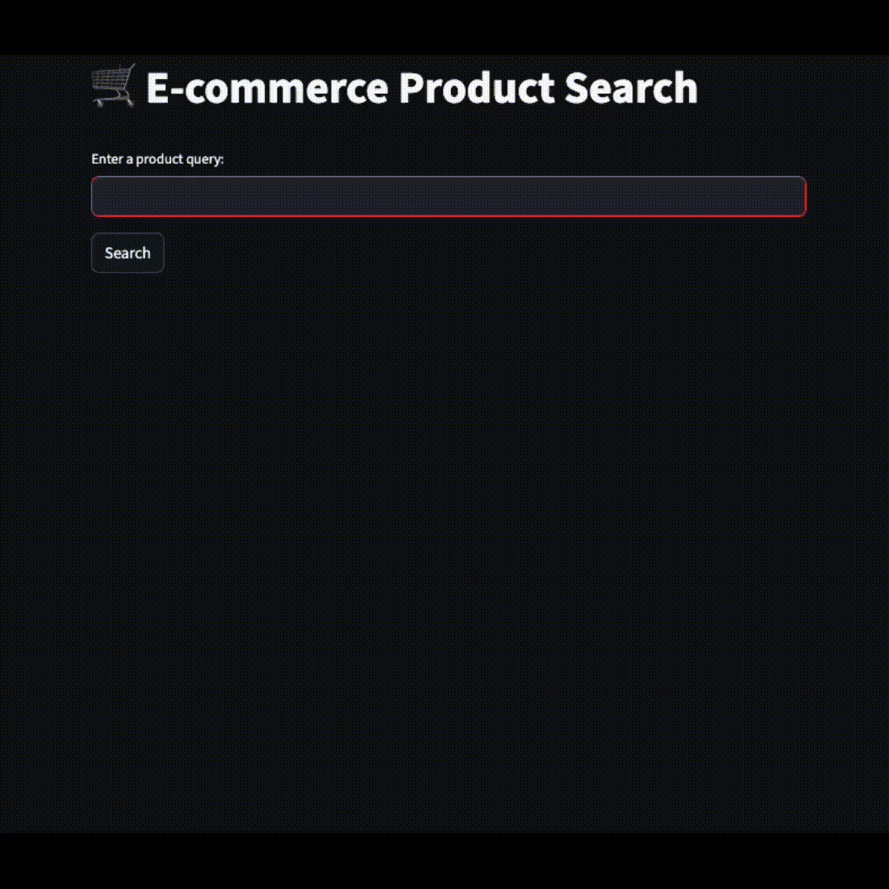

# 🛒 Product Search App

## Overview

The **Product Search App** is an intelligent e-commerce assistant built using LangChain and Streamlit. It allows users to search for products by entering queries and displays detailed product information, including name, brand, model, specifications, price, and a clickable product link.

## Features

- **Intelligent Product Search**: Powered by LangChain and Groq models to provide accurate product recommendations.
- **Dynamic Theme Support**: Automatically adjusts the background and text colors based on the user's system theme (light or dark mode).
- **Interactive UI**: Built with Streamlit for a clean and responsive interface.
- **Product Details**: Displays product information in a visually appealing card layout.

## Demo

Check out the demo video to see the app in action:




## Installation

### Prerequisites

- Python 3.8 or higher
- Streamlit
- LangChain
- Groq API Key

### Steps

1. Clone the repository:

   ```bash
   git clone https://github.com/jatinder06/product-search-app.git
   cd product-search-app
   ```
2. Install dependencies:

   ```bash
   pip install -r requirements.txt
   ```
3. Set up environment variables:

   - Create a `.env` file in the root directory.
   - Add the following variables:
     ```
     GROQ_API_KEY=your_groq_api_key
     LANGCHAIN_API_KEY=your_langchain_api_key
     LANGCHAIN_PROJECT=your_project_name
     ```
4. Run the app:

   ```bash
   streamlit run app/app.py
   ```

## Usage

1. Enter a product query in the input field (e.g., "Find best mobile phone deal").
2. Click the **Search** button.
3. View the product details displayed in a card layout.

## Technologies Used

- **LangChain**: For intelligent product recommendations.
- **Streamlit**: For building the interactive UI.
- **Groq Models**: For powering the backend AI.

## Contributing

Contributions are welcome! Feel free to open issues or submit pull requests.

## License

This project is licensed under the MIT License.
